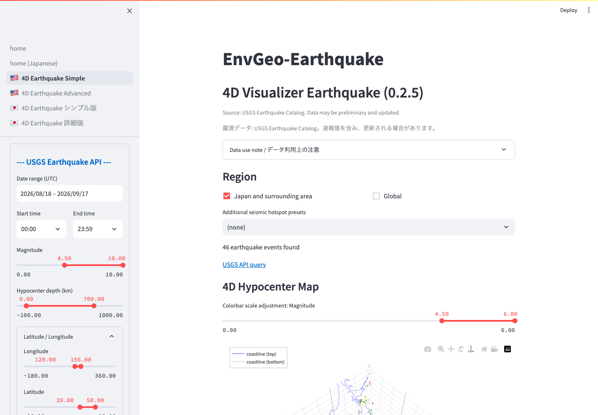

# USGS Earthquake Catalog API Settings

The `USGS Earthquake API` section in the sidebar defines the catalog query.

*The sidebar contains query controls. After changing a filter, confirm the event count and plots in the main area.*

## Date and Time (UTC)

Set the start and end dates in `Date range (UTC)` and select start/end times in UTC. The default period is the most recent 30 days.

Long periods, large regions, and low magnitude thresholds may retrieve many events and take longer to display.

## Magnitude

- For a wide-area overview, try M4.5 or higher.
- For a small region, lower the minimum when more detail is required.
- To review only major events, try M6 or higher.

## Hypocenter Depth

`Hypocenter depth (km)` controls the query depth range. The default is 0-700 km. Use an upper limit near 100 km for shallow seismicity, or include depths to about 700 km for deep subduction-zone earthquakes.

## Latitude and Longitude

The region preset initializes a representative search rectangle. Longitude can be set from -180 to 360 degrees, which supports regions crossing the date line. The USGS rectangular query width must not exceed 360 degrees.

## Order By

- `time`: newest first.
- `time-asc`: oldest first.
- `magnitude`: largest magnitude first.
- `magnitude-asc`: smallest magnitude first.

## Maximum Events

`Max events` accepts 1-20,000 events. If the result reaches the limit, matching earthquakes may remain outside the returned catalog. Shorten the period, narrow the region, or raise the minimum magnitude and query again.

## Refresh and Cache

Filters update the data. Use `Refresh / clear API cache` near the bottom of the sidebar when you need to discard cached API results and retrieve them again.

