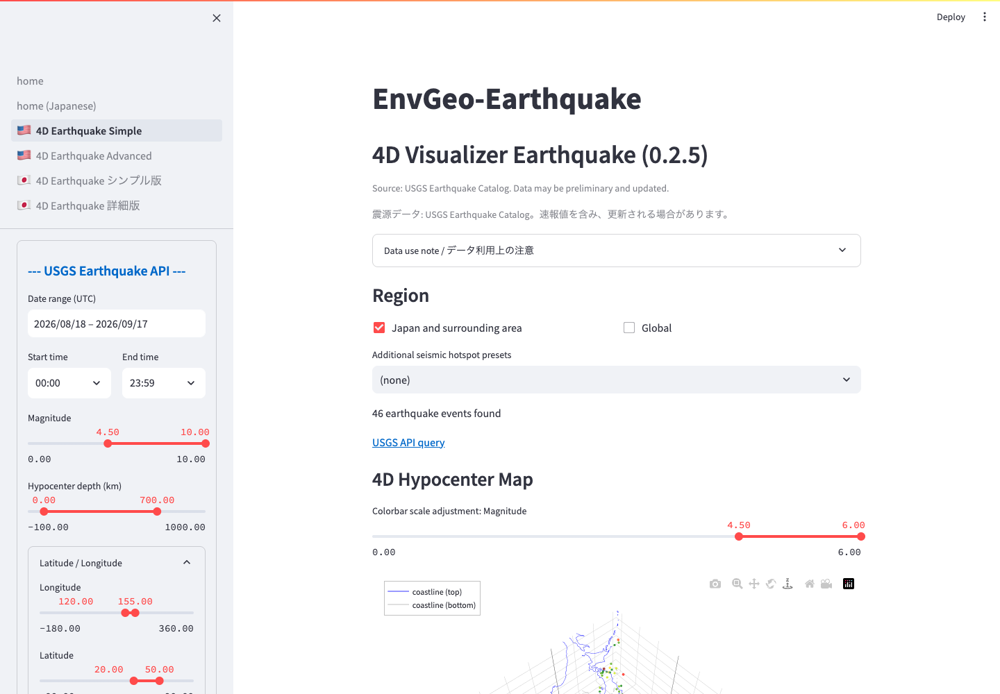

# Simple 4D Visualizer

The Simple visualizer retrieves a USGS catalog and shows its distribution in 3D/4D and 2D maps.

*Query controls, event count, and the 4D hypocenter map are visible together. Drag and zoom to inspect the plot.*

## Common Uses

- Build a quick overview of an earthquake distribution.
- Examine the relationship between magnitude and depth in 3D.
- Inspect event location, size, and depth on a map.
- Export the current USGS catalog to CSV.

## 4D Hypocenter Map

The horizontal axes use local kilometer coordinates and the vertical axis represents hypocenter depth. This makes the horizontal scale easier to interpret geologically than raw longitude and latitude axes.

- Drag to rotate.
- Scroll to zoom.
- Use the Plotly toolbar at the upper right to switch rotation, pan, zoom, or
  reset the camera.
- Holding `Shift`, `Control`, `Option` (`Alt`), or `Command` while dragging can change how the
  viewpoint or center moves; behavior varies by browser and operating system.
- Hover over an event to inspect time, place, magnitude, depth, and other values.
- Adjust `3D Z-axis display scale` to compress or emphasize the apparent depth dimension.

## Visualization Settings

- `Displayed depth range (km)`: depth interval shown in plots.
- `Marker size mode`: switch between `Magnitude-linked` and `Fixed size`.
- `Magnitude contrast (M7/M4 diameter ratio)`: adjust the visual difference
  from `1` to `30`; the default is `20`. It is disabled in fixed-size mode.
- `3D marker size scale`: 3D event size.
- `2D marker size scale`: 2D event size.
- `3D Z-axis display scale`: apparent vertical exaggeration.
- `Pacific-centered 3D view (180°)`: centers a global view on the Pacific.
- `Colorbar variable`: color by `Magnitude` or `Hypocenter depth`.

`Magnitude-linked` is the default and makes larger earthquakes larger in both
the 3D and 2D views. Its contrast slider directly sets the M7:M4 marker-diameter
ratio; the default `20` makes M7 about twenty times M4. This is a display emphasis, not a physical
energy or rupture-area scale. `Fixed size` removes the magnitude difference. The two
size sliders are direct overall multipliers from `0.2` to `10.0`: `1.0` is the
standard size, and `10.0` produces ten times the unclipped pixel size.

## 2D Map

The 2D view automatically zooms to the retrieved catalog. Available basemaps include Standard, Satellite Imagery, Ocean Bathymetry, and GSI Topographic Map. Marker size follows the selected size mode and color follows the selected colorbar variable.

## CSV Export

Expand `Retrieved earthquake data (CSV)` to review the table and use `Download CSV`.
