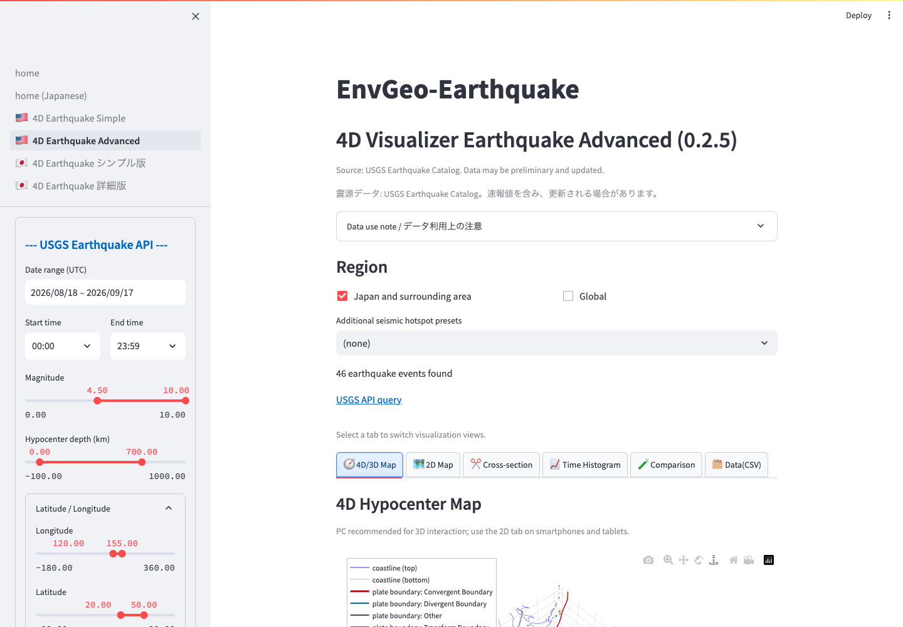

# Advanced 4D Visualizer Earthquake

The Advanced visualizer adds plate boundaries, a user-defined cross-section, a depth profile, a time histogram, and JMA/NIED comparison to the 3D/4D and 2D views.

*The analysis tabs appear below the query summary. Select the view that matches your task.*

## Tabs

- `4D/3D Map`: 3D/4D hypocenter distribution.
- `2D Map`: geographic distribution.
- `Cross-section`: user-defined A-B section and depth profile.
- `Time Histogram`: event counts through time.
- `Comparison`: uploaded external catalog compared with USGS.
- `Data(CSV)`: USGS catalog table and CSV download.

## Plate Boundaries

Enable `Overlay plate boundaries` in the sidebar to add boundaries from the USGS Tectonic Plate Boundaries service to maps. Enable `Include microplates` when those additional boundaries are useful; it is enabled by default around Japan.

These lines are schematic and intended for research and education, not official hazard assessment.

## User-defined Cross-section

Specify the longitude and latitude of endpoints A and B, then set `Section half-width (km)`. A wider corridor includes more events but lowers spatial specificity; a narrow corridor isolates earthquakes close to the A-B line.

The section location map shows the A-B line and extraction corridor.

## Depth Profile

The depth profile counts earthquakes by depth. A small `Depth bin width (km)` reveals finer structure; a larger bin emphasizes the overall pattern.

## Time Histogram

The histogram aggregates earthquakes over the selected period. Increase the number of bins for finer temporal resolution, or reduce it for a clearer overall trend.

## Color and Marker Size

Use `Colorbar variable` to switch between magnitude and hypocenter depth. Reduce marker scales when points overlap, or increase them for a small catalog.

