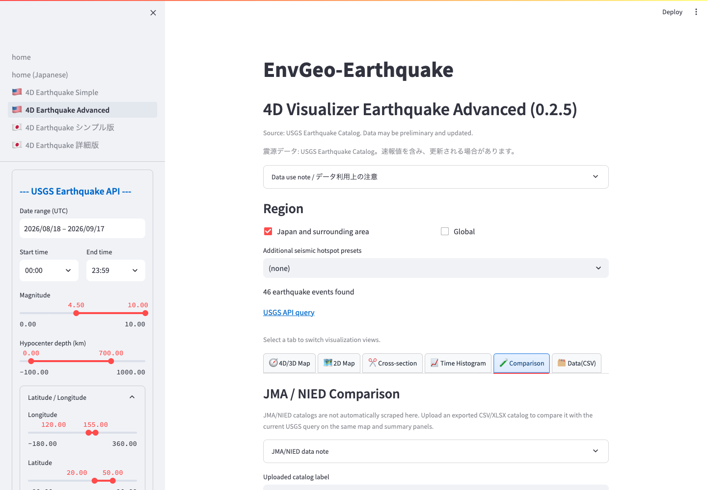

# JMA / NIED Comparison

The `Comparison` tab accepts a user-provided JMA, NIED Hi-net, JMA unified catalog, or similar Japanese catalog and compares it with the current USGS data.

*Open `Comparison`, choose a catalog label, and upload the catalog file.*

The app does not automatically retrieve external catalogs. Upload a CSV, TSV, TXT, XLSX, or XLS file that you obtained and may use under the provider's terms.

## Upload Steps

1. Open the Advanced visualizer.
2. Set the USGS date, area, magnitude, and depth filters.
3. Open `Comparison`.
4. Select the uploaded catalog label: JMA, NIED Hi-net, JMA Unified Catalog, or another Japanese catalog.
5. Choose the catalog table in the upload control.

## Required Fields

The uploaded table must provide longitude, latitude, hypocenter depth, and magnitude. Time and place fields are used in hover details and summaries when available. Common column names are standardized automatically, but unusual names or custom formats may not be recognized.

## Results

After a successful upload, the app shows a summary table, an overlaid 2D map, and depth-distribution histograms for the USGS and uploaded catalogs.

## Use Notes

JMA and NIED data may have registration, attribution, redistribution, or other conditions. Check the provider's current terms before using the data in research, publications, teaching materials, or public websites.

This comparison is especially useful around Japan. Interpret results carefully when another region preset is selected.

