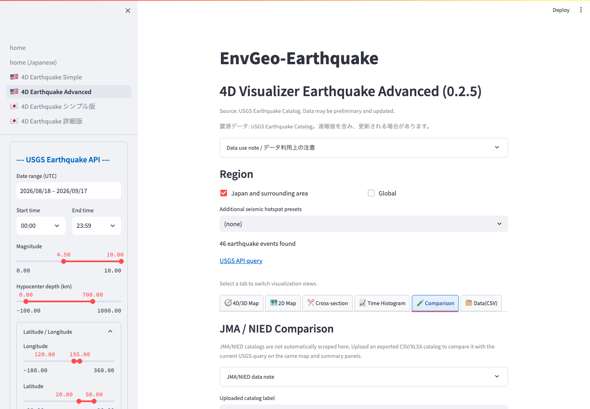

# JMA / NIED Comparison

The `Comparison` tab is an optional Advanced-page tool. It accepts a
user-provided JMA, NIED Hi-net, JMA unified catalog, or similar Japanese
catalog and compares it with the current USGS data. It is not required for the
main USGS visualization workflow.

*Open `Comparison`, choose a catalog label, and upload the catalog file.*

The app does not automatically retrieve external catalogs. Upload a CSV, TSV,
TXT, or XLSX file that you obtained and may use under the provider's terms.
Legacy binary `.xls` files are not accepted; save them as `.xlsx` or a text
format before upload.

The selected file is read for the current Streamlit session. EnvGeo-Earthquake
does not intentionally save it to a persistent application data store. Remove
the file from the upload control or end the session when the comparison is no
longer needed.

## Upload Steps

1. Open the Advanced visualizer.
2. Set the USGS date, area, magnitude, and depth filters.
3. Open `Comparison`.
4. Select the uploaded catalog label: JMA, NIED Hi-net, JMA Unified Catalog, or another Japanese catalog.
5. Choose the catalog table in the upload control.

## Required Fields

The uploaded table must provide longitude, latitude, hypocenter depth, and magnitude. Time and place fields are used in hover details and summaries when available. Common column names are standardized automatically, but unusual names or custom formats may not be recognized.

## Results

After a successful upload, the app shows a summary table, an overlaid 2D map, and depth-distribution histograms for the USGS and uploaded catalogs.

## Use Notes

JMA website content generally requires source credit and an indication of any
editing or processing. NIED Hi-net prohibits redistribution of downloaded data
and hypocenter information. Work derived from Hi-net data must follow its
provider-acknowledgement, DOI-citation, and result-reporting requirements.
Other organizations' data distributed through Hi-net remain subject to their
own rules.

The app accepting and reading a file does not establish permission to publish
or redistribute it. File-format conversion also does not change its terms. See
the bilingual [JMA/NIED responsibility record](../jma_nied_data_responsibilities.md)
before using uploaded data in research, publications, teaching materials, or a
public website.

This comparison is especially useful around Japan. Interpret results carefully when another region preset is selected.
