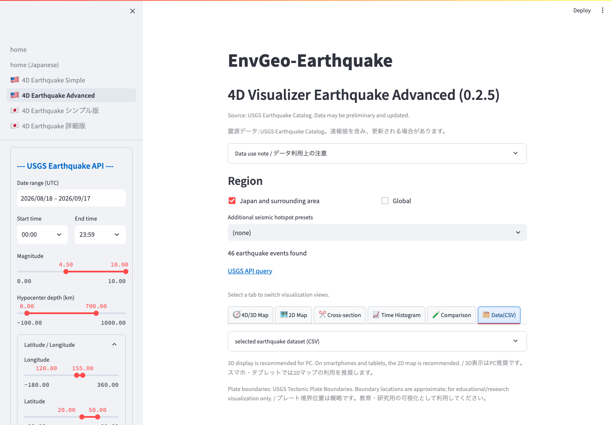

# Data Export and Important Notes

## CSV Export

Use `Retrieved earthquake data (CSV)` or the Advanced visualizer's `Data(CSV)` tab to inspect and download the USGS catalog.

*Advanced `Data(CSV)` tab. Expand the data section to display the table and download control.*

Main columns include:

- `EventID`: USGS event ID.
- `DateTime_UTC`: origin time.
- `Magnitude`: magnitude value.
- `MagnitudeType`: magnitude scale/type.
- `Depth_km`: hypocenter depth.
- `Longitude_degE`: longitude.
- `Latitude_degN`: latitude.
- `Place`: USGS place description.
- `URL`: USGS event page.

`Download CSV` saves the displayed catalog as `usgs_earthquake_catalog.csv`.

## USGS Data

The app uses the USGS Earthquake Catalog API / FDSN Event Web Service. Preliminary locations, depths, magnitudes, and event metadata may be revised. Cite the USGS/ANSS Comprehensive Catalog or another appropriate source in publications and teaching material.

## Plate Boundaries

Plate boundaries come from the USGS Tectonic Plate Boundaries service. If it is unavailable, the app may display schematic fallback lines around Japan. Do not treat these lines as official fault traces or hazard zones.

## Analysis Cautions

- If the result reaches the event limit, additional matching events may be omitted.
- Wide regions, long periods, and low magnitude thresholds can make the app slow.
- Vertical exaggeration can make the 3D view differ from true scale.
- When comparing catalogs, account for detection thresholds, magnitude scales, depth methods, time formats, and preliminary/final status.

## Emergency Use

This app is not an official earthquake alert, tsunami warning, evacuation, or emergency-response system. For safety decisions, use official information from USGS, JMA, local authorities, and emergency agencies.

