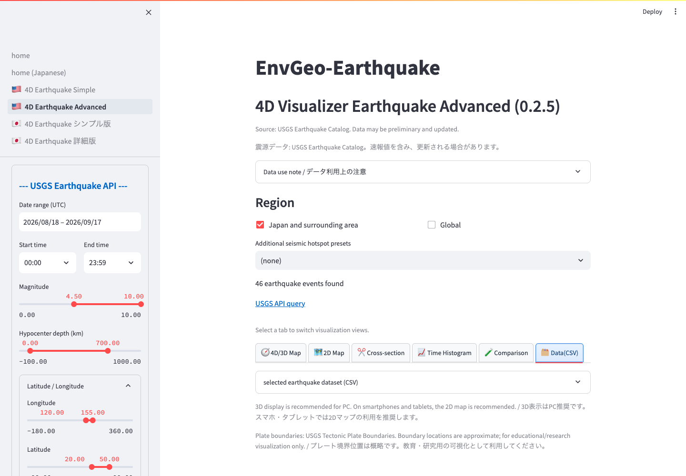

# Data Export and Important Notes

## CSV Export

Use `Retrieved earthquake data (CSV)` or the Advanced visualizer's `Data(CSV)` tab to inspect and download the USGS catalog.

*Advanced `Data(CSV)` tab. Expand the data section to display the table and download control.*

Main columns include:

- `EventID`: USGS event ID.
- `DateTime_UTC`: origin time.
- `Magnitude`: magnitude value.
- `MagnitudeType`: magnitude scale/type.
- `Depth_km`: hypocenter depth.
- `Longitude_degE`: longitude.
- `Latitude_degN`: latitude.
- `Place`: USGS place description.
- `URL`: USGS event page.

`Download CSV` saves the displayed catalog as `usgs_earthquake_catalog.csv`.

## USGS Data

The app uses the USGS Earthquake Catalog API / FDSN Event Web Service. Preliminary locations, depths, magnitudes, and event metadata may be revised. Use the catalog citation recorded by the FDSN USGS data-center entry:

> U.S. Geological Survey. (2017). Advanced National Seismic System (ANSS) Comprehensive Catalog. U.S. Geological Survey. https://doi.org/10.5066/F7MS3QZH

## Plate Boundaries

Plate boundaries come from the USGS Tectonic Plate Boundaries service. If it is unavailable, the app may display schematic fallback lines around Japan. Do not treat these lines as official fault traces or hazard zones.

The service metadata cites the USGS Seismicity of the Earth Map Series and:

> Bird, P. (2003). An updated digital model of plate boundaries. Geochemistry, Geophysics, Geosystems, 4(3), 52 pp. https://doi.org/10.1029/2001GC000252

> DeMets, C., Gordon, R. G., & Argus, D. F. (2010). Geologically current plate motions. Geophysical Journal International, 181, 1–80. https://doi.org/10.1111/j.1365-246X.2009.04491.x

## Coastline Reference Layer

The bundled 50m and 110m coastline CSVs are visual-reference layers derived
from Natural Earth coastline v4.1.0, which Natural Earth places in the public
domain. Their checksums, retained derivation evidence, and provenance
limitations are recorded in the bilingual
[source and terms record](../../coastline/LICENSE_OR_SOURCE.md). Do not use
these generalized lines for navigation, legal boundaries, or hazard decisions.

## Online Map Backgrounds

- Standard: `© OpenStreetMap contributors`. CARTO basemaps are not configured.
  Do not bulk-download or prefetch the standard OSM tiles for offline use.
- Satellite: `USDA, USGS The National Map: Orthoimagery`.
- Bathymetry: credit Esri and the contributors shown on the map. The background
  is not for navigation or safety at sea.
- Topographic: credit `国土地理院`. Recheck GSI requirements before static
  publication or redistribution.

The provider links and complete current credit text are maintained in the
[main README](../../README.md). Keep the on-map attribution visible in figures
and recheck the provider terms for each publication or static export.

## Analysis Cautions

- If the result reaches the event limit, additional matching events may be omitted.
- Wide regions, long periods, and low magnitude thresholds can make the app slow.
- Vertical exaggeration can make the 3D view differ from true scale.
- When comparing catalogs, account for detection thresholds, magnitude scales, depth methods, time formats, and preliminary/final status.

## Validation Policy

The bilingual [minimal validation policy](../earthquake_validation.md)
preserves the current display workflow. USGS values are treated as source data;
new checks are limited to preventing crashes, reporting retrieval/read errors,
and safely handling user uploads. The app does not assign its own scientific
quality grade to USGS records.

## Emergency Use

This app is not an official earthquake alert, tsunami warning, evacuation, or emergency-response system. For safety decisions, use official information from USGS, JMA, local authorities, and emergency agencies.
