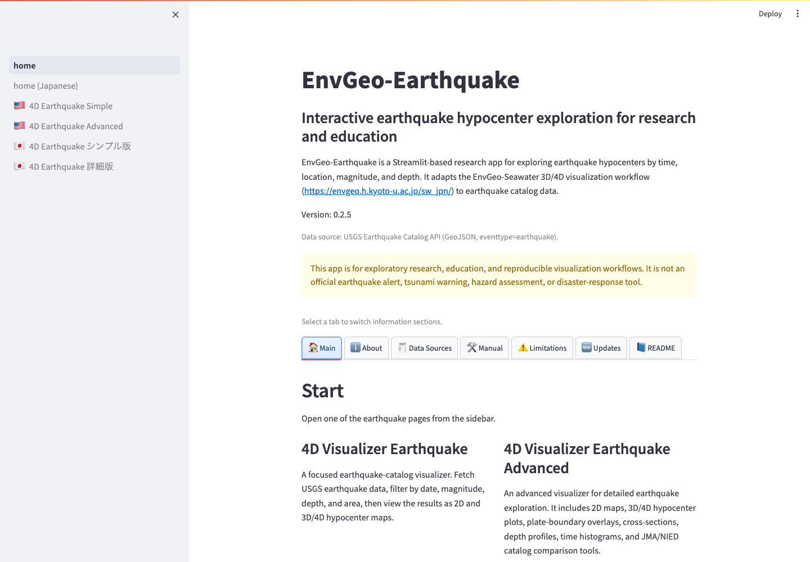

# EnvGeo-Earthquake User Manual

This manual explains the main workflows and visualization pages in EnvGeo-Earthquake.

[日本語マニュアル](../manual_Japanese/README.md)

EnvGeo-Earthquake is a Streamlit app for exploring earthquake hypocenter catalogs from the USGS Earthquake Catalog API using 2D maps, 3D/4D views, arbitrary cross-sections, depth profiles, and time histograms. It is intended for research, education, and exploratory analysis. It is not an official earthquake alert, tsunami warning, emergency-response, or hazard-assessment system.

*English home page. Choose the Simple or Advanced visualizer from the left sidebar.*

## Contents

- [Overview](00_overview.md)
- [Quick Start](01_quick_start.md)
- [USGS Earthquake Catalog API Settings](02_usgs_query.md)
- [Simple 4D Visualizer](03_simple_visualizer.md)
- [Advanced 4D Visualizer](04_advanced_visualizer.md)
- [JMA / NIED Comparison](05_jma_nied_comparison.md)
- [Data Export and Important Notes](06_export_and_notes.md)

## Suggested Reading Order

1. Start with [Overview](00_overview.md) and [Quick Start](01_quick_start.md).
2. Use [USGS Earthquake Catalog API Settings](02_usgs_query.md) when adjusting the catalog query.
3. Use the [Simple visualizer](03_simple_visualizer.md) for a quick distribution overview, or the [Advanced visualizer](04_advanced_visualizer.md) for sections and comparison tools.
4. Read [JMA / NIED Comparison](05_jma_nied_comparison.md) before uploading a Japanese catalog.

## Covered Pages

- `pages/54_🇺🇸_4D_Earthquake_Simple.py`
- `pages/55_🇺🇸_4D_Earthquake_Advanced.py`

