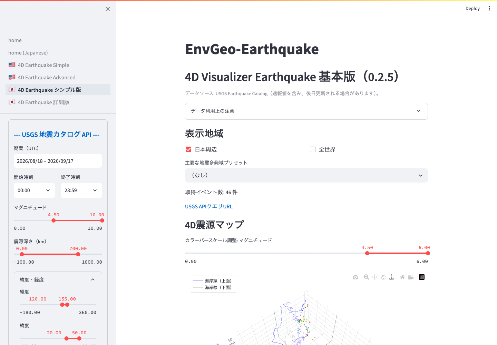

# 起動と基本操作

## ローカルで起動する

必要なパッケージをインストールした環境で、`earthquake_map_v030` ディレクトリに移動して実行します。

```bash
streamlit run home.py
```

起動後、ターミナルに表示されるローカル URL をブラウザで開きます。通常は `http://localhost:8501` です。

## ページを選ぶ

Streamlit のサイドバーからページを選択します。



*基本版の初期画面。左側で検索条件を設定し、右側で取得件数と可視化を確認します。*

- 日本語で手早く確認する: `4D Earthquake シンプル版`
- 日本語で詳しく解析する: `4D Earthquake 詳細版`
- 英語 UI を使う: `4D Earthquake Simple` または `4D Earthquake Advanced`

## 基本的な操作の流れ

1. 表示地域を選びます。
2. サイドバーの `USGS 地震カタログ API` で期間、マグニチュード、深さ、緯度・経度範囲を設定します。
3. 条件を変更するとデータが更新されます。明示的に再取得する場合は `再取得 / APIキャッシュをクリア` を使います。
4. `可視化設定` で深さ表示範囲、マーカーサイズ、色分け項目などを調整します。
5. 3D/4D、2D、断面、時系列、データ表を切り替えながら確認します。

## 表示地域の選び方

上部の `表示地域` で、解析範囲のプリセットを選びます。

- `日本周辺`: 日本列島、海溝、周辺の震源分布を見る場合
- `全世界`: 全球の大きな地震分布やプレート境界を概観する場合
- `主要な地震多発域プリセット`: インドネシア、ニュージーランド、チリ沖、アリューシャン、カムチャッカ、ヒマラヤ、フィリピンなどを素早く選ぶ場合

プリセットを選ぶと、経度・緯度スライダーの初期値がその地域に合わせて設定されます。

## 推奨される使い方

3D/4D 表示は PC での利用を推奨します。スマートフォンやタブレットでは、2D マップやデータ表を中心に確認すると操作しやすくなります。
