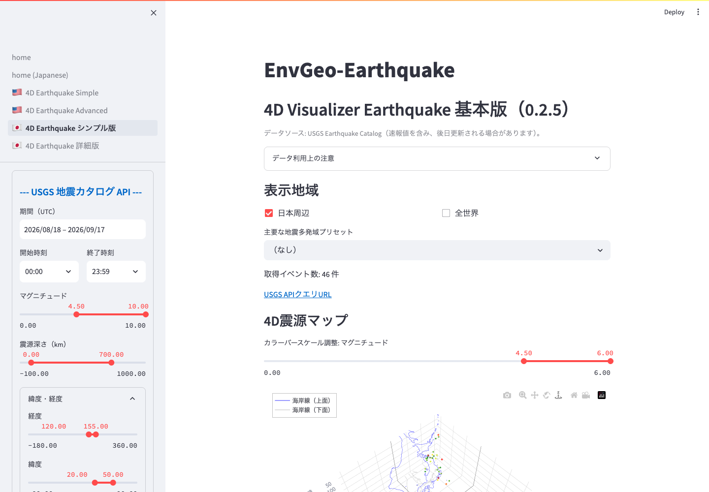

# 簡易版 4D Visualizer Earthquake

簡易版は、USGS 震源カタログを取得し、3D/4D 震源マップと 2D 震源マップで分布を確認するためのページです。

*検索条件、取得件数、4D震源マップを一画面で確認できます。図はマウス操作で回転・拡大できます。*

## 主な用途

- 地震分布の全体像を素早く確認する
- 震源深さとマグニチュードの関係を 3D で見る
- 地図上で地震の位置、規模、深さを確認する
- 取得した USGS カタログを CSV で保存する

## 4D 震源マップ

3D/4D 表示では、横方向をローカルな km 座標、縦方向を震源深さとして表示します。経緯度をそのまま 3D 軸に使うよりも、水平スケールを地球科学的に見やすくするための処理です。

操作のポイント:

- マウスドラッグで回転できます。
- スクロールで拡大・縮小できます。
- 右上のPlotlyツールバーで回転・平行移動・拡大縮小を切り替え、初期視点へ戻せます。
- `Shift`、`Control`、`Option`（`Alt`）、`Command`キーを押しながらドラッグすると、視点や中心の動かし方を
  変えることができます。実際の挙動はブラウザとOSにより異なります。
- 点にカーソルを合わせると、時刻、場所、マグニチュード、深さなどを確認できます。
- `3D Z軸表示倍率` を小さくすると深さ方向が圧縮され、大きくすると深さ方向が強調されます。

## 可視化設定

サイドバーの `可視化設定` で表示を調整します。

- `深さ表示範囲（km）`: 図に表示する深さ範囲を調整します。
- `マーカーサイズ方式`: `マグニチュード連動` と `固定サイズ` を切り替えます。
- `マグニチュード強調率（M7 / M4 直径比）`: 表示上の大きさ差を`1–30`で調整します。
  既定は`20`で、固定サイズ時は無効です。
- `3Dマーカーサイズ倍率`: 3D の点の大きさを調整します。
- `2Dマーカーサイズ倍率`: 2D マップの点の大きさを調整します。
- `3D Z軸表示倍率`: 深さ方向の見かけの比率を調整します。
- `3D太平洋中心表示（180°）`: 全世界表示時に、太平洋を中心にした 3D 表示にします。
- `カラーバー項目`: 色分けを `マグニチュード` または `震源深さ` から選びます。

既定の `マグニチュード連動` では、3D・2Dとも大きな地震ほど大きく表示します。
`マグニチュード強調率`でM7:M4のmarker直径比を直接指定し、既定`20`では約20:1になります。
これは見分けやすさのための表示上の強調で、
energyや断層面積の物理scaleではありません。
`固定サイズ` ではマグニチュード差をサイズに反映しません。2つの倍率sliderは
`0.2–10.0` の全体直接倍率で、`1.0` が標準、`10.0` ではclip前のpixel sizeが10倍になります。

## 2D 震源マップ

2D マップでは、震源位置を地図上に表示します。表示範囲は取得データに合わせて自動ズームされます。

地図スタイルは次から選べます。

- `標準`
- `衛星画像`
- `海底地形（海域）`
- `等高線（国土地理院）`

地図上の点はマグニチュードに応じて大きさが変わります。色は `カラーバー項目` の設定に従います。

## CSV 出力

`取得地震データ（CSV）` を開くと、取得した USGS カタログの表を確認できます。`CSVダウンロード` から保存できます。
