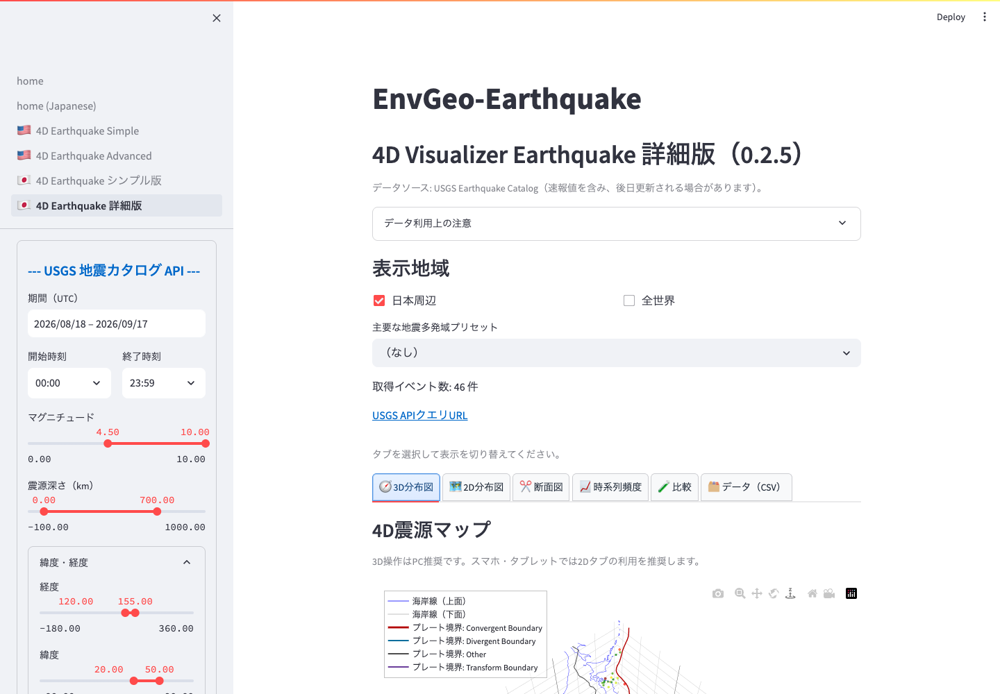

# 詳細版 4D Visualizer Earthquake

詳細版は、簡易版の 3D/4D 表示と 2D マップに加えて、プレート境界、任意断面図、深度プロファイル、時系列ヒストグラム、JMA/NIED 比較を扱うページです。

*詳細版では、検索条件の下に可視化タブが並びます。目的に応じて表示を切り替えます。*

## タブ構成

詳細版には、主に次の表示があります。

- `3D分布図`: 震源分布の 3D/4D 表示
- `2D分布図`: 地図上での震源分布
- `断面図`: 任意断面図と深度プロファイル
- `時系列頻度`: 地震発生数のヒストグラム
- `比較`: アップロードした外部カタログとの比較
- `データ（CSV）`: 取得した USGS カタログの表と CSV 出力

## プレート境界

サイドバーの `プレート境界を重ねて表示` をオンにすると、USGS Tectonic Plate Boundaries service から取得したプレート境界を 2D マップや断面位置マップに重ねます。

`マイクロプレートも含める` をオンにすると、利用可能な場合はマイクロプレート境界も表示します。日本周辺ではオンが初期値です。

プレート境界は教育・研究用の概略表示です。公式なハザード評価や防災判断には使用しないでください。

## 任意断面図

`任意断面図` では、始点 A と終点 B を経度・緯度で指定し、その線に沿った震源分布を深さ方向に表示します。

設定項目:

- `始点 経度`
- `始点 緯度`
- `終点 経度`
- `終点 緯度`
- `断面半幅（km）`

断面半幅は、A-B 線の左右何 km までの地震を断面に含めるかを指定します。値を大きくするとイベント数は増えますが、断面の空間分解能は粗くなります。値を小さくすると、断面線に近い地震だけを抽出できます。

断面図の下には `断面位置マップ` が表示され、A-B 線と抽出幅を地図上で確認できます。

## 深度プロファイル

`深度プロファイル` では、深さごとの地震数を棒グラフで表示します。

`深さビン幅（km）` を変更すると、深さ方向の集計幅を調整できます。小さい値では細かい構造を見やすく、大きい値では全体傾向を把握しやすくなります。

## 時系列ヒストグラム

`時系列ヒストグラム` では、取得期間内の地震数を時間方向に集計します。

`時間ビン数` を増やすと時間分解能が細かくなり、減らすと全体傾向を見やすくなります。余震活動や特定期間の地震発生数変化を確認する場合に使います。

## 色とマーカーサイズ

詳細版でも、サイドバーの `カラーバー項目` で色分けを切り替えます。

- `マグニチュード`: 規模の違いを見たい場合
- `震源深さ`: 浅発・深発地震の分布を見たい場合

`3Dマーカーサイズ倍率`、`2Dマーカーサイズ倍率`、`断面図マーカーサイズ倍率` は、それぞれの図の点の大きさを調整します。点が重なって見にくい場合は倍率を下げ、イベント数が少ない場合は倍率を上げると確認しやすくなります。
