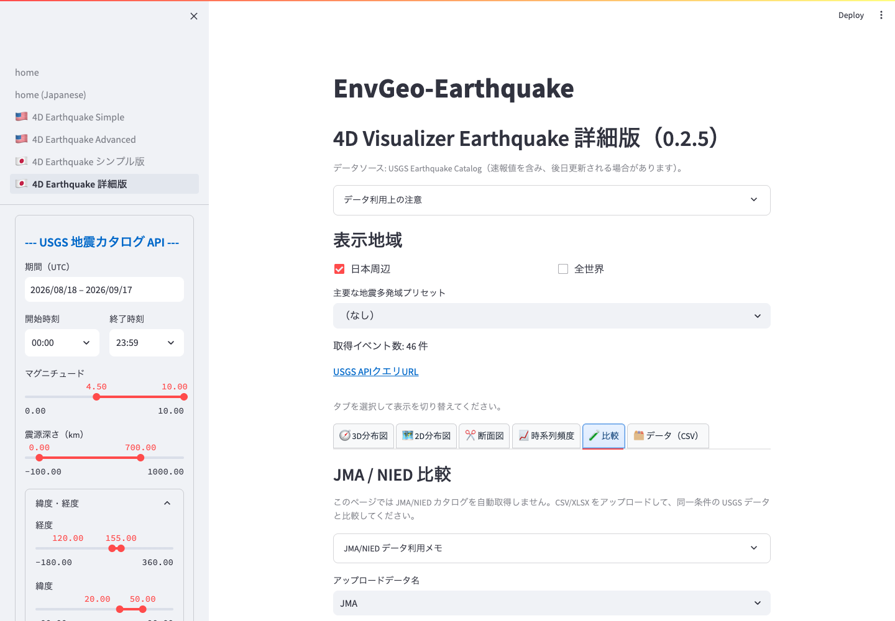

# JMA / NIED 比較

詳細版の `JMA / NIED 比較` では、利用者が用意した JMA、NIED Hi-net、JMA 統一カタログなどの表をアップロードし、同じ画面で USGS データと比較できます。

*`比較` タブを開き、データ種別を選んでカタログファイルをアップロードします。*

この機能は外部カタログを自動取得しません。利用者自身が取得し、利用条件を確認した CSV、TSV、TXT、XLSX、XLS ファイルをアップロードします。

## アップロード手順

1. 詳細版ページを開きます。
2. USGS 側の期間、範囲、マグニチュード、深さを設定します。
3. `比較` タブを開きます。
4. `アップロードデータ名` で、`JMA`、`NIED Hi-net`、`JMA統一カタログ`、`その他（日本のカタログ）` のいずれかを選びます。
5. `JMA/NIED カタログ表をアップロード` からファイルを選びます。

## 必要な列

比較を有効にするには、アップロード表に次の情報が必要です。

- 経度
- 緯度
- 震源深さ
- マグニチュード

時刻や地名に相当する列がある場合は、ホバー表示や比較表で利用されます。列名は内部で標準化されますが、特殊な列名や独自形式の場合は読み取れないことがあります。

## 表示される内容

アップロードに成功すると、次の内容が表示されます。

- USGS とアップロードカタログの概要表
- USGS と外部カタログを重ねた 2D マップ
- カタログ別の深度分布ヒストグラム

カタログごとの震源位置、深さ、マグニチュードの違いを概観できます。

## 利用上の注意

JMA や NIED のデータには、利用規約、登録要件、謝辞要件、再配布制限がある場合があります。研究、発表、教材、Web 公開で使用する場合は、必ず提供元の最新の利用条件を確認してください。

JMA/NIED 比較は、日本周辺の解析で特に有効です。日本以外の地域プリセットでもタブは表示されますが、比較対象データの性質に注意してください。
