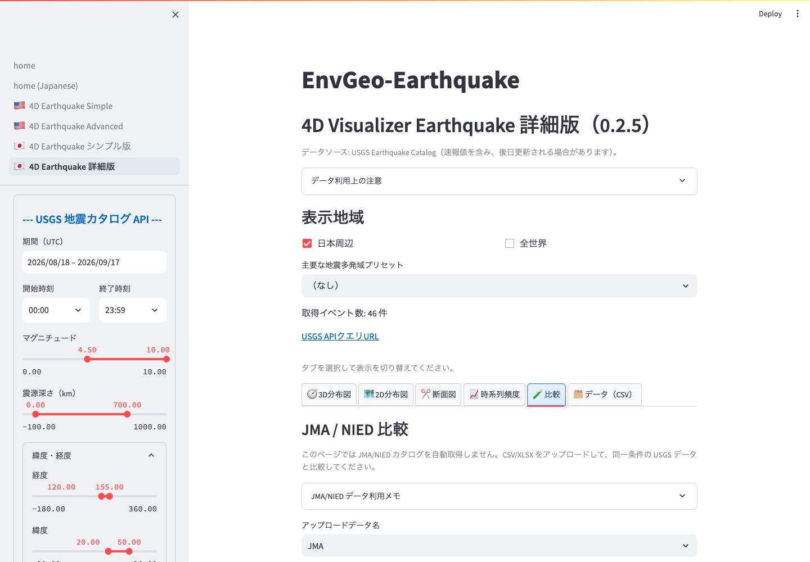

# JMA / NIED 比較

詳細版の `JMA / NIED 比較` は任意機能です。利用者が用意した JMA、NIED Hi-net、
JMA 統一カタログなどの表をアップロードし、同じ画面で USGS データと比較できます。
主要なUSGS可視化workflowの利用には必要ありません。

*`比較` タブを開き、データ種別を選んでカタログファイルをアップロードします。*

この機能は外部カタログを自動取得しません。利用者自身が取得し、利用条件を確認した
CSV、TSV、TXT、XLSXファイルをアップロードします。古いbinary形式の`.xls`は受け付けないため、
アップロード前に`.xlsx`またはtext形式へ保存し直してください。

選択したfileは現在のStreamlit session内で読み込みます。EnvGeo-Earthquakeは、
そのfileを意図的に永続的なアプリdata storeへ保存しません。比較が不要になったら、
upload controlからfileを外すかsessionを終了してください。

## アップロード手順

1. 詳細版ページを開きます。
2. USGS 側の期間、範囲、マグニチュード、深さを設定します。
3. `比較` タブを開きます。
4. `アップロードデータ名` で、`JMA`、`NIED Hi-net`、`JMA統一カタログ`、`その他（日本のカタログ）` のいずれかを選びます。
5. `JMA/NIED カタログ表をアップロード` からファイルを選びます。

## 必要な列

比較を有効にするには、アップロード表に次の情報が必要です。

- 経度
- 緯度
- 震源深さ
- マグニチュード

時刻や地名に相当する列がある場合は、ホバー表示や比較表で利用されます。列名は内部で標準化されますが、特殊な列名や独自形式の場合は読み取れないことがあります。

## 表示される内容

アップロードに成功すると、次の内容が表示されます。

- USGS とアップロードカタログの概要表
- USGS と外部カタログを重ねた 2D マップ
- カタログ別の深度分布ヒストグラム

カタログごとの震源位置、深さ、マグニチュードの違いを概観できます。

## 利用上の注意

JMA website contentは、原則として出典と編集・加工表示が必要です。NIED Hi-netは
downloadしたdata・震源情報の再配布を禁止しています。Hi-net dataによる成果では、
提供機関の謝辞、DOI引用、成果報告要件に従います。Hi-netを通じた他機関dataには
各機関の規則も適用されます。

アプリがfileを受け付けて読み込むことは、出版・再配布許可を意味しません。形式変換でも
利用条件は変わりません。研究、発表、教材、Web公開の前に、日英の
[JMA/NIED利用者責任記録](../jma_nied_data_responsibilities_Japanese.md)を確認してください。

JMA/NIED 比較は、日本周辺の解析で特に有効です。日本以外の地域プリセットでもタブは表示されますが、比較対象データの性質に注意してください。
