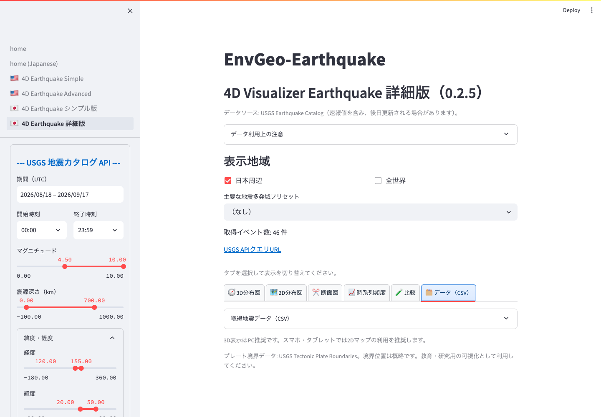

# データ出力と利用上の注意

## CSV 出力

`取得地震データ（CSV）` または詳細版の `データ` タブでは、USGS から取得した地震カタログを表として確認できます。

*詳細版の `データ（CSV）` タブ。`取得地震データ（CSV）` を開くと表とダウンロードボタンが表示されます。*

主な列:

- `EventID`: USGS イベント ID
- `DateTime_UTC`: 発震時刻
- `Magnitude`: マグニチュード
- `MagnitudeType`: マグニチュード種別
- `Depth_km`: 震源深さ
- `Longitude_degE`: 経度
- `Latitude_degN`: 緯度
- `Place`: USGS による場所表記
- `URL`: USGS イベントページ

`CSVダウンロード` を押すと、表示中の USGS カタログを `usgs_earthquake_catalog.csv` として保存できます。

## USGS データについて

本アプリは USGS Earthquake Catalog API / FDSN Event Web Service を利用します。地震情報には速報値が含まれ、後から震源位置、深さ、マグニチュード、イベント情報が更新される場合があります。

出版物、教材、公開資料で利用する場合は、USGS/ANSS Comprehensive Catalog など、適切な出典を明記してください。

## プレート境界について

プレート境界は USGS Tectonic Plate Boundaries service を利用します。サービスに接続できない場合、日本周辺では概略的なフォールバック線を表示することがあります。

プレート境界の位置は概略です。公式な断層線、ハザードゾーン、災害対応の判断材料として使用しないでください。

## 解析時の注意

- 取得件数が上限に達している場合、表示されていないイベントが残っている可能性があります。
- 広域・長期間・低マグニチュード条件では、イベント数が多くなり、表示が重くなることがあります。
- 3D 表示では、見やすさのために深さ方向の表示倍率を変更できます。図の見た目は実スケールそのものではない場合があります。
- 異なるカタログを比較する場合、検知能力、マグニチュード種別、深さ決定方法、時刻表記、速報値・確定値の違いに注意してください。

## 緊急時の利用

このアプリは、公式の地震速報、津波警報、防災対応、避難判断のためのシステムではありません。緊急時や安全に関わる判断では、気象庁、USGS、自治体、防災機関などの公式情報を確認してください。
