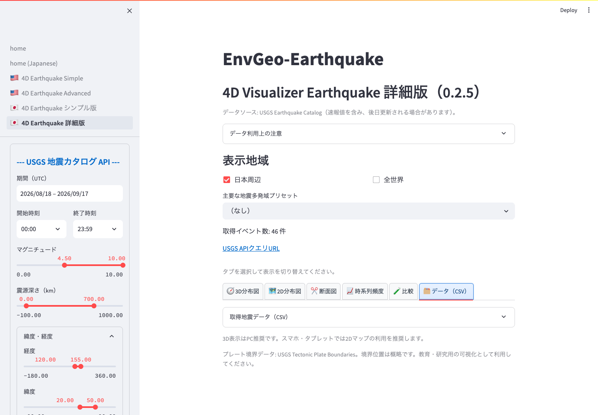

# データ出力と利用上の注意

## CSV 出力

`取得地震データ（CSV）` または詳細版の `データ` タブでは、USGS から取得した地震カタログを表として確認できます。

*詳細版の `データ（CSV）` タブ。`取得地震データ（CSV）` を開くと表とダウンロードボタンが表示されます。*

主な列:

- `EventID`: USGS イベント ID
- `DateTime_UTC`: 発震時刻
- `Magnitude`: マグニチュード
- `MagnitudeType`: マグニチュード種別
- `Depth_km`: 震源深さ
- `Longitude_degE`: 経度
- `Latitude_degN`: 緯度
- `Place`: USGS による場所表記
- `URL`: USGS イベントページ

`CSVダウンロード` を押すと、表示中の USGS カタログを `usgs_earthquake_catalog.csv` として保存できます。

## USGS データについて

本アプリは USGS Earthquake Catalog API / FDSN Event Web Service を利用します。地震情報には速報値が含まれ、後から震源位置、深さ、マグニチュード、イベント情報が更新される場合があります。

出版物、教材、公開資料では、FDSNのUSGS data-center recordに記録された次の引用を使用してください。

> U.S. Geological Survey. (2017). Advanced National Seismic System (ANSS) Comprehensive Catalog. U.S. Geological Survey. https://doi.org/10.5066/F7MS3QZH

## プレート境界について

プレート境界は USGS Tectonic Plate Boundaries service を利用します。サービスに接続できない場合、日本周辺では概略的なフォールバック線を表示することがあります。

プレート境界の位置は概略です。公式な断層線、ハザードゾーン、災害対応の判断材料として使用しないでください。

service metadataはUSGS Seismicity of the Earth Map Seriesと、次の文献を出典として示しています。

> Bird, P. (2003). An updated digital model of plate boundaries. Geochemistry, Geophysics, Geosystems, 4(3), 52 pp. https://doi.org/10.1029/2001GC000252

> DeMets, C., Gordon, R. G., & Argus, D. F. (2010). Geologically current plate motions. Geophysical Journal International, 181, 1–80. https://doi.org/10.1111/j.1365-246X.2009.04491.x

## 海岸線参照レイヤー

同梱の50m・110m海岸線CSVは、Natural Earthがpublic domainとしているcoastline v4.1.0由来の
表示用参照レイヤーです。checksum、保持された派生根拠、来歴上の制約は、日英の
[出典・利用条件記録](../../coastline/LICENSE_OR_SOURCE_Japanese.md)に記録しています。
一般化された線のため、航法、法的境界、hazard判断には使用しないでください。

## オンライン地図背景

- 標準: `© OpenStreetMap contributors`。CARTO basemapは設定していません。
  offline利用のためにOSM標準tileを一括download・prefetchしないでください。
- 衛星画像: `USDA, USGS The National Map: Orthoimagery`。
- 海底地形: Esriと地図上に表示されるcontributorsをcreditしてください。
  航海・海上安全判断には使用しないでください。
- 地形図: `国土地理院`。静的な出版・再配布前にGSIの要件を再確認してください。

提供元linkと完全な最新credit文は[日本語README](../../README_Japanese.md)に記録しています。
図では地図上のattributionを見える状態に保ち、出版・静的出力ごとに最新条件を
再確認してください。

## 解析時の注意

- 取得件数が上限に達している場合、表示されていないイベントが残っている可能性があります。
- 広域・長期間・低マグニチュード条件では、イベント数が多くなり、表示が重くなることがあります。
- 3D 表示では、見やすさのために深さ方向の表示倍率を変更できます。図の見た目は実スケールそのものではない場合があります。
- 異なるカタログを比較する場合、検知能力、マグニチュード種別、深さ決定方法、時刻表記、速報値・確定値の違いに注意してください。

## 検証方針

日英の[最小検証方針](../earthquake_validation_Japanese.md)は現行の表示workflowを維持します。
USGS値はsource dataとして扱い、新しいcheckはcrash防止、取得・読込みerrorの表示、
利用者uploadの安全な処理に限定します。USGS recordに独自の科学的quality等級を付けません。

## 緊急時の利用

このアプリは、公式の地震速報、津波警報、防災対応、避難判断のためのシステムではありません。緊急時や安全に関わる判断では、気象庁、USGS、自治体、防災機関などの公式情報を確認してください。
