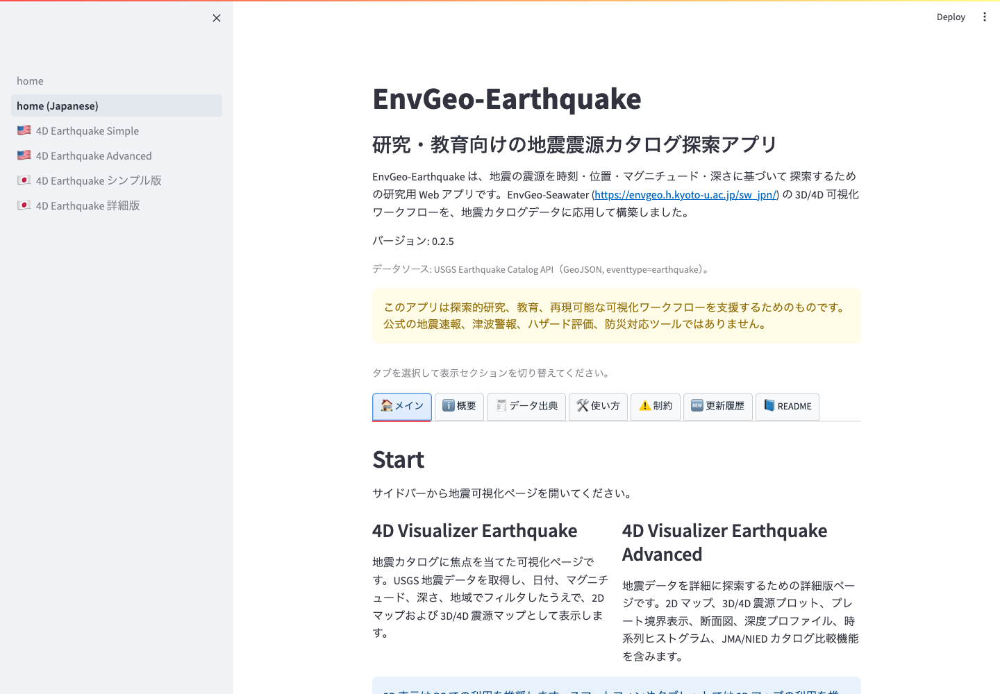

# EnvGeo-Earthquake ユーザーマニュアル

このマニュアルは、EnvGeo-Earthquake の基本的な使い方と、各可視化ページの操作方法をまとめたものです。

[English manual](../manual/README.md)

EnvGeo-Earthquake は、USGS Earthquake Catalog API から取得した震源カタログを、2D マップ、3D/4D 表示、任意断面、深度プロファイル、時系列ヒストグラムで探索する Streamlit アプリです。研究・教育・探索的解析を目的としており、公式の地震速報、津波警報、防災判断、ハザード評価のためのシステムではありません。

*日本語ホーム画面。左のサイドバーから基本版または詳細版を開きます。*

## 目次

- [概要](00_overview.md)
- [起動と基本操作](01_quick_start.md)
- [USGS 地震カタログ API の設定](02_usgs_query.md)
- [基本版 4D Visualizer Earthquake](03_simple_visualizer.md)
- [詳細版 4D Visualizer Earthquake](04_advanced_visualizer.md)
- [JMA / NIED 比較](05_jma_nied_comparison.md)
- [データ出力と利用上の注意](06_export_and_notes.md)

## 読み方

1. 初めて使う場合は、[概要](00_overview.md) と [起動と基本操作](01_quick_start.md) を確認します。
2. 取得する地震データの条件を調整したい場合は、[USGS 地震カタログ API の設定](02_usgs_query.md) を確認します。
3. 震源分布を手早く確認したい場合は [基本版](03_simple_visualizer.md)、断面図や比較まで行う場合は [詳細版](04_advanced_visualizer.md) を参照します。
4. アップロードした日本周辺カタログと比較する場合は、[JMA / NIED 比較](05_jma_nied_comparison.md) を確認します。

## 対象ページ

- `pages/56_🇯🇵_4D_Earthquake_シンプル版.py`
- `pages/57_🇯🇵_4D_Earthquake_詳細版.py`

英語版ページを使う場合も、操作の考え方は同じです。
